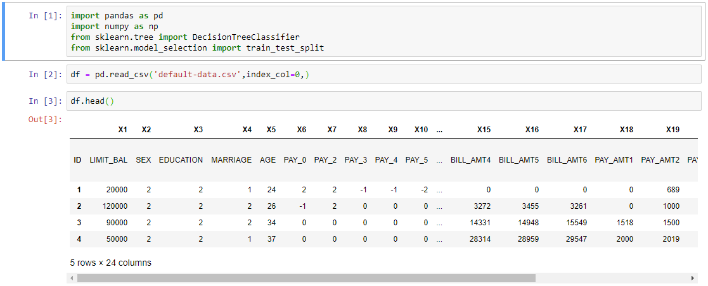
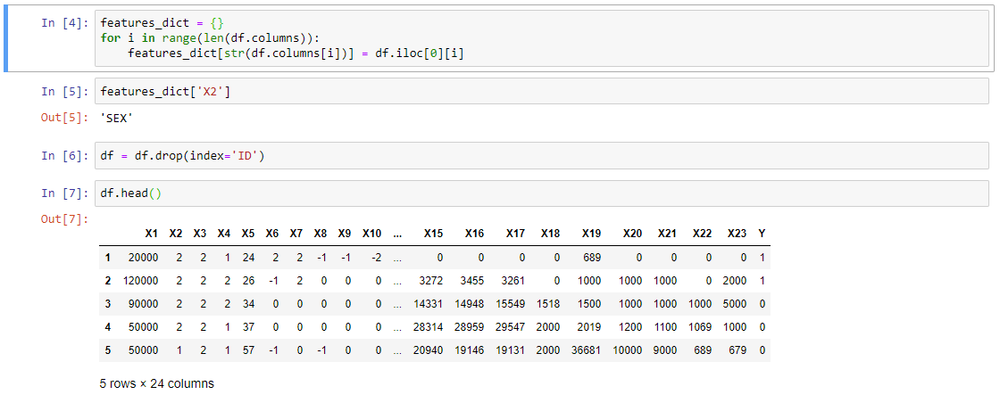
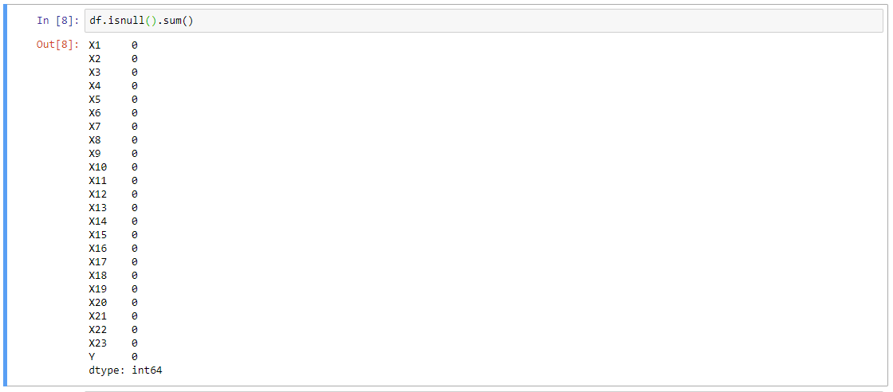
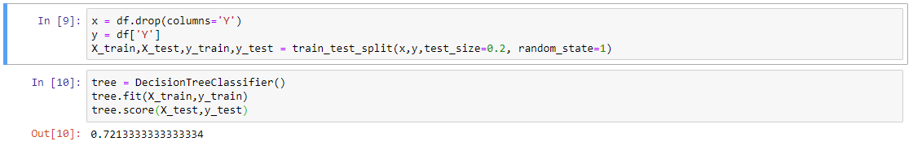
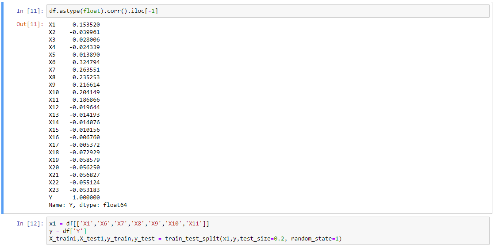
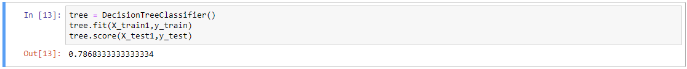

[Homepage](https://brandenmoo.github.io/)
# Predicting Whether Credit Card Clients Will Default
This Decision Tree model was built to predict whether clients of a credit card company will default given some features about the clients.
This is a simple project to demonstrate the basics of building a decision tree. Decision trees are rarely used on their own, they are most
often used to build random forest models. As such, this project only aims to highlight the components of a random forest model. 

### Project Details 
**Data Source Url:** http://archive.ics.uci.edu/ml/datasets/default+of+credit+card+clients 
**Model Type:** Decision Tree  
**Source Code**: [GitHub File](https://github.com/brandenmoo/brandenmoo.github.io/blob/master/Source_Codes/DecisionTreeDefault.ipynb)

### Building The Model
To begin, I import the libraries that I will be using in this project. Then I imported the data into a DataFrame: 

I noticed the data structure isn’t correct, this would inter with building a model. To fix the issue, I stored the feature information in a dictionary and removed the row from the DataFrame. 
I used a dictionary so that I can easily access the feature description if needed. 

Next, I checked if there were missing or null values in the data: 

Since there’s no missing data, I didn’t need to do any cleaning. Using all the features available, I split the data into a training and test set and built a decision tree. Even though the values looked like integers, they were actually ‘string’ type. Scikit-Learn’s decision tree classifier does not accept strings as input, so it automatically converted the values to ‘float’ type. I didn’t normalize the data because in a decision tree, each feature is kept separate: 

Using all the features, the model correctly predicted 72.13% of the test data. To try and improve that slightly, I built a second model containing only features with notable correlation. I had to convert the data in the DataFrame to ‘float’ type in order to use the .corr() object: 

It worked to improve accuracy slightly: 

Scikit-Learn builds a decision by splitting features that result in lowest Gini impurity, and recursively splits until there is no more information gain. This results in a static model that is very prone to overfitting. Random forest fixes both those issues by using multiple trees and bagging. 

http://spotdigitalinc.com/#a_aid=testnumber1&a_bid=bf9e98b6 (Link)

[TextLink] (<a href="http://spotdigitalinc.com/#a_aid=testnumber1&amp;a_bid=79543e40" target="_top"><strong>Text Link Preview</strong> </a>)
