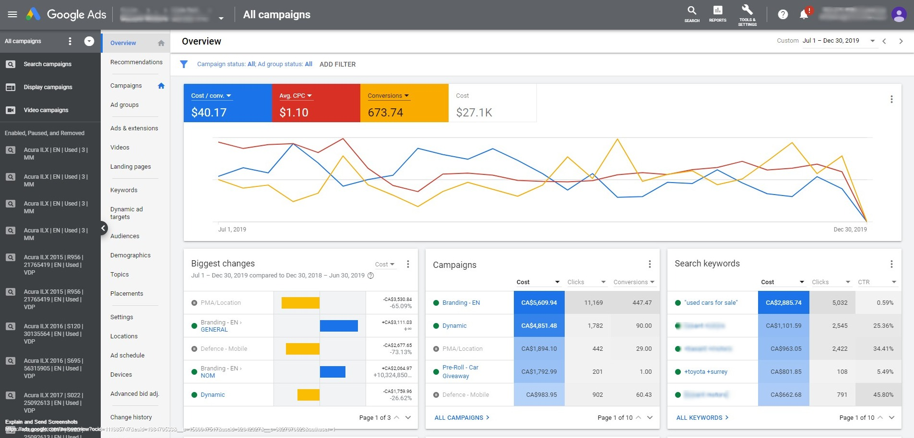

[Homepage](https://brandenmoo.github.io/)

# Google Ad Campaign Breakdown
This is a screenshot of the overview of a campaign I've ran for a client, the client is a Acura Dealership. Sensitive information have been redacted out of respect for the client.  

 
### Overview
When I first took on this client, they had CPA of around $120. While high CPA in the automotive industry isn't uncommon due to the nature of the industry, but $120 is far from the industry average of $30 to $50. Upon further investigation, I realized the previous marketing managers did not do a good job setting up the client's campaigns. So I restructured the account into 6 primary campaigns: Brand, Competitors, Location, Dynamic, Promotions, and Display. 

### Brand Campaign
The purpose of the Brand campaign is to defend the client's brand and 'real estate' on Google's SERP. Through Google's assessment of content relevance, ads in our Brand campaign cost very little to the us, but will drive up CPC for competitors that try to poach traffic searching for our brand name. The purpose of this campaign isn't to generate qualified leads, it is to ensure traffic that intended to come to our website do not get poached. The keywords in this campaign consists of only the client's brand name. 

### Competitors Campaign
This campaign serves the opposite function as the Brand campaign. If a competitor is running a sales event that isn't as attractive as ours, then we will utilize this campaign to target customers drawn to those sales. This isn't the main lead generation campaign, therefore it doesn't receive a high portion of the budget. The keywords in this campaign consist of competitors brand name and keywords used in their offer promotions. 

### Location Campaign
This campaign is the main lead generation campaign, and receives majority of the budget. Using data from Google Analytics, I can determine factors that increase conversion rate; thus, creating targeted landing pages and delivering them through different ad groups within the Location campaign. For example, cleaning and analyzing the Google Analytics data for this client revealed that some areas are more interested in SUVs and some areas are more interested in sedans. This makes sense when segmented down by age group, areas with more families show more interest in SUVs and areas with younger residents show more interest in sedans. With this information, I created ads promoting Acura models most likely generate qualified leads, and geo-targeted them along with a tailored landing page. 

### Dynamic Campaign 
This campaign is dedicated to letting Google Ads dynamic ad feature create and target the ads. This feature delivers varying results, so it requires close monitoring to ensure high ROI. 

### Promotions
When the client wants to promote a sales event, I use this campaign to do so. I create a separate campaign for promotions so it doesn't interfere with the ads that run year-round. 

### Display Ads
HTML5 ads have increased the efficacy of display ads, so I like to dedicate some budget to it. While it doesn't generate a lot of conversions, I believe it helps with brand recognition and awareness. Taking into account the relatively low cost of impression, I think display ads are a good investment. 

### Results
Through the implementation of these strategies, I reduced the client's CPA to around $40. Paid marketing is a powerful user acquisition channel, but can be extremely costly if implemented incorrectly. While setting up campaigns for clients, I pay close attention to keyword selection and exclusion to avoid one campaign cannibalizing  the performance of another. 
