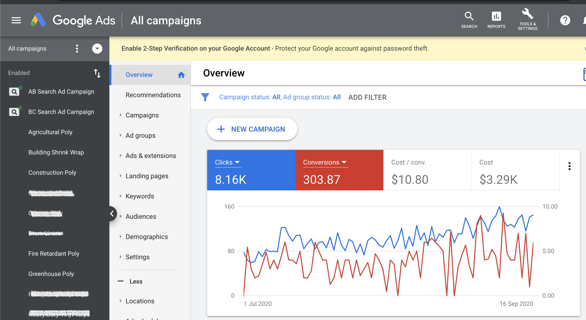
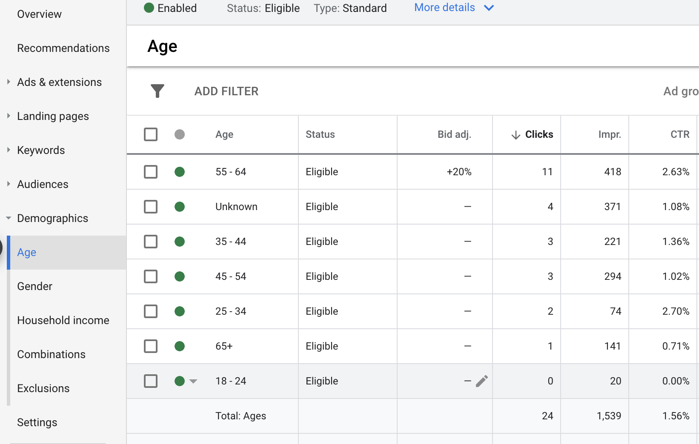

[Homepage](https://brandenmoo.github.io/)

# Google Ad Campaign Breakdown
This is a screenshot of the overview of a campaign I've ran for a client, the client is a Commercial Covers Manufacturer. Sensitive information have been redacted out of respect for the client.  

 
### Overview
When I started managing this client's account, they were struggling to get clicks and conversions. After doing an in-depth analysis of the account, I decided that before I attempt to increase conversions, it is more beneficial to increase clicks. The reason for this is because I don't believe the Google Machine Learning Algorithm is able to correctly learn and optimize performance based off of ~80 clicks/day. So I wanted to increase the amount of clicks the campaigns were receiving in order to increase learning data. This case study will highlight some of the strategies I've used. 

### Bidding Strategy 
The first thing I did was change the bid strategy from Maximize Conversions to Maximize Clicks. I did this because I didn't want Google to overfit the limited data it was receiving. In other words, I didn't want Google to base its targeting off of the first few conversions. I wanted to build a wider range of successful audience before allowing Google to extrapolate conversion data.

### Keyword Research
Analyzing the Search Terms allowed me to identify high performing keywords that were not on the Search Keywords list. It is important to understand that there are many ways to express the same thing, so constantly studying the Search Terms to see how people are finding your website is crucial to increasing clicks and conversions. That being said, I did pay close attention to the keywords that were completely irrelevant, and added it to the Negative Keywords list to reduce unnecessary cost. 

### Ad Copy Rewrite 
I rewrote all the ad copies for this client to follow best practices. The main change I implemented was the inclusion of a call-to-action at the end. Many studies have shown that a CTA is crucial to increase CTR, so I made sure to include one. Further more, I made sure to include only relevant content to entice searchers to click the ad. Unfortunately, the client has asked me not to feature the ads in this case study.

### Bid Adjustment
Bid adjustment is a powerful tool to increase clicks or conversions. I looked at the performance for each age and demographic groups, and identified opportunities to utilize an increased bid adjustment. In the example shown below, I noticed that the CTR for the 55-64 age group was more than 2x of other age groups, so I increased the bid adjustment for that group. Going through each ad group and identifying these opportunities can have a great effect for overall performance.

### Results and Next Steps
Since I started managing this cient's account, I have almost doubled the number of clicks using the methods I've mentioned above. The next step is to focus on conversions. I plan on increasing conversions by revamping the client's website, particularly the landing pages, to create a unified user experience. This includes ensuring consistent language, relevant information, and appropriate website design for the demographic. 
