# Predicting Subscription Of Term Deposit 
This project is to build a K-nearest neighbour model that predicts whether clients will subscribe to a term deposit offered by a Portuguese 
bank. The data set offered 17 features about the clients. 

### Project Details
**Data Source URL:** http://archive.ics.uci.edu/ml/datasets/Bank+Marketing
**Modelling Type:** K-nearest neighbour
**Source Code:** [GitHub File](https://github.com/brandenmoo/brandenmoo.github.io/blob/master/Source_Codes/KNN-Bank.ipynb)

### Building The Model
First step is to import the libraries that will be used in this project, as well as importing the data set as a DataFrame: 
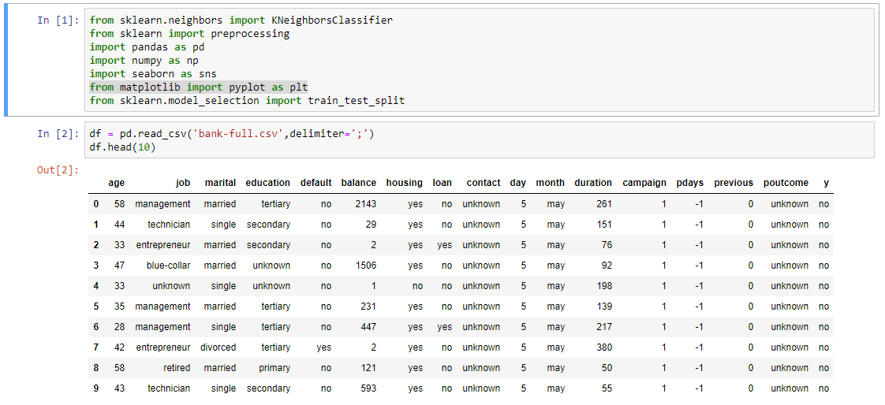

This data set contains 45211 instances: 
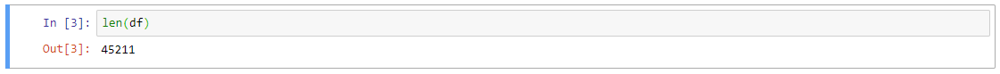

In the description of the data, it is noted that a ‘999’ value for the feature ‘previous’ denotes a client that has not been previously contacted. I decided to convert ‘999’ to ‘unknown’ for reasons that will be discussed in the reflection section. 
 
To begin cleaning the data, I wrote this for loop to iterate through the entire DataFrame to check for unknown values. The output is names of columns that contain unknown values: 
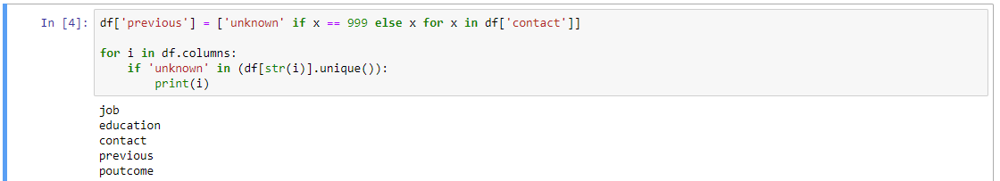

Next I need to know how many unknown values are in each feature: 
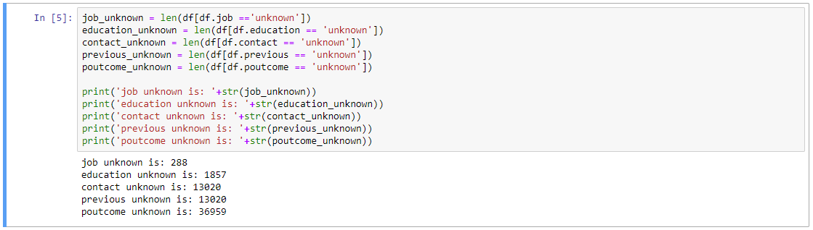

I decided to remove ‘contact’, ‘previous, and ’poutcome’ due to the high number of unknown values. For ‘job’ and ‘education’, I removed the instances containing ‘unknown’. 
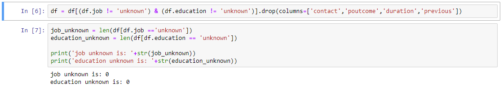

I wanted to see the 5 number summary of ‘age’ and ‘balance’, so I used Seaborn’s boxplot method (no reason to perform this on other features since they were categorical). This information is very useful for the normalization process later on:  
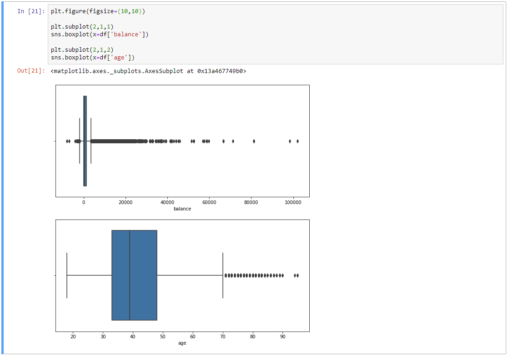

Now that the data has been cleaned, the categorical data must be encoded into integers and all data must be normalized. I’ve chosen min-max normalization methods: 
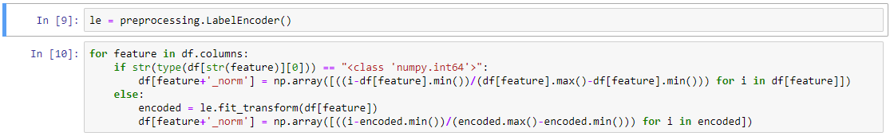

For the first model, I’ve included all the features for training: 
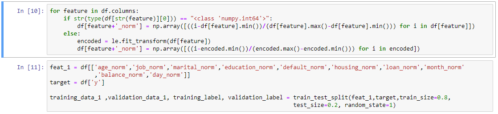

I used a for loop to iterate through 100 k values to get the best accuracy:
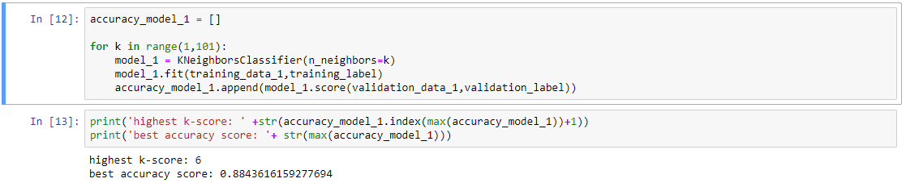

Most of the time, k-nearest neighbour works best with a small number of features, so I only used 3 features to train model 2: 
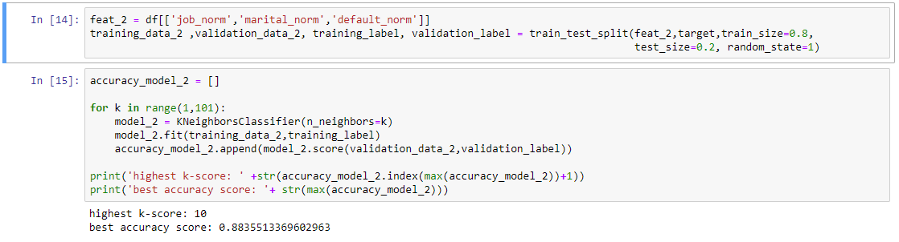

Referring to the boxplots, there numerical data consisted of many outliers. Min-max normalization is easily skewed by outliers, so I wanted to compare the results of model 1 and 2 with models created by z-score normalized data. I created a separate DataFrame and normalized it using z-scores:
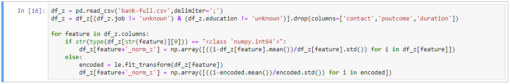

I used the same features as model 1 and 2 to compare the difference between different methods of normalizing data: 
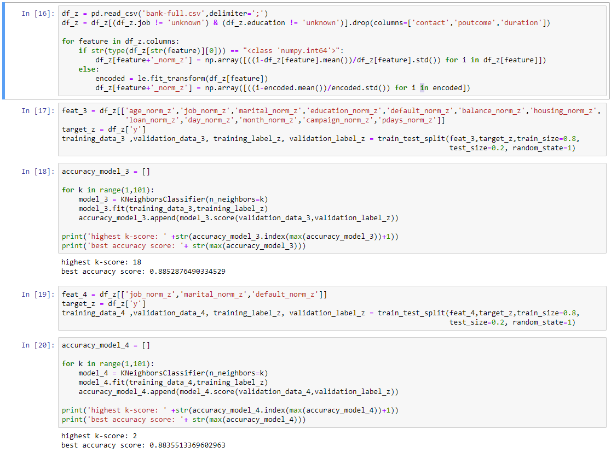

### Conclusion And Reflection
This project was meant to build the structure for a K-nearest neighbour model. If the goal was to create a model with highest predictive value, then I would create models with varying features and compared the accuracy. 
The reason I’ve elected to turn ‘999’ into ‘unknown’ for the ‘previous’ feature is because categorical and numeric data can’t be combined. Using ‘999’ would suggest it’s been 999 days since the last contact, which would skew the data significantly.  

