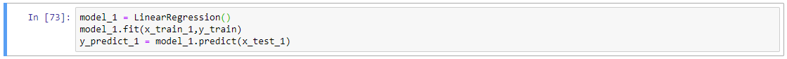

# Predicting House Price With Linear Regression
This is a Linear Regression project to build a model that predicts the price of an apartment in Taiwan given multiple features. A linear regression model that utilizes more than one feature is known as multiple linear regression.  

### Project Details
**Data Source URL:** http://archive.ics.uci.edu/ml/datasets/Real+estate+valuation+data+set#  
**Modelling Type:** Multiple Linear Regression  
**Source Code:** [GitHub File](Source_Codes/LinearRegression1.ipynb)

### Building The Model
To start, I imported the libraries that I will be using in this project:

Then, import the .csv file containing the data as a DataFrame using pandas. I like to display the first 10 rows of the DataFrame to get a quick overview of the dataset: 
![Image1]<images/LinReg1/LN1-2.png>

Before jumping into building any models, it is important to perform data cleaning. First, I checked if there are any missing or null values in the data set, in this case there are no missing values: 

After checking for missing values, I like to use the box plot feature of Seaborn to get the 5 number summary of the independent variables. Performing descriptive analyses before working with a data set allows us to gain an understanding of the range, which may help us identify patterns and relationships later. A bonus of using box plot is it also displays statistical outliers in the independent variables. For this data set, the independent variables that are appropriate for plotting are house age, distance to nearest MRT station, and number of convenience stores: 

The box plot shows that there are outliers in the ‘distance to the nearest MRT station’ feature. One of the main reasons to remove outliers is a strong probability that the data was incorrectly recorded or inaccurately reported. Since the distance between a property and the nearest MRT station is a relatively simple value to capture, I’ve decided to keep the outliers. I believe the probability of those data points revealing an underlying relationship is higher than it being a mistake or an exception. 

This concludes the data cleaning step. 

Next, we need to examine the relationships between the independent variables with the dependent variables, as well as relationships between each of the independent variables. To do this, I use the .corr( ) object in pandas: 

This step is extremely important for choosing which independent variable to include in the model training process. Independent variables must not have a strong correlation with each other, or else it will skew the model and affect its accuracy. This step also allows us to identify which features have no correlation with the dependent variable. Features with low correlation will not be included in the model training. The correlation table above shows that the independent variables have no correlation with each other, but it does show a low correlation between transaction date and the price so we will exclude that from our model training. 
Next step is to split our data into a training set and test set. A rule of thumb is 80/20 split for training and testing respectively. However, I don’t feel that this data set has enough instances to train the model with a 80/20 split, so I have decided to use a 90/10 split for training and testing respectively: 

To split the data, I use the built-in function of scikit-learn: 

Random state has been set to a value of 1 for reasons that will be discussed at the end, but for now, the training and test set have been divided. 
Using those data sets, we can build the first model. I named it model_1 because I will be building several to compare the accuracies: 

Now that I have built a model, I need to check its R-squared value on the test data set: 

0.769 is quite a high score, but this is the only the first model I built. To try and improve it, I check the coefficients to see if there are variables that I can remove: 

‘Distance to nearest MRT station’ has a near-zero coefficient, so I decided to drop that feature for the next model: 

Dropping ‘Distance to nearest MRT station’ did not improve the performance of model_2: 

Just to make sure I cannot improve model_1 by dropping features with low coefficients, I built model_3 by dropping ‘house age’ as well as ‘Distance to nearest MRT station’: 

 This did not improve the performance of the model: 

### Conclusion and Reflection
model_1 proved to be the best performer with a R-squared value of 0.769, removal of features with low correlation was not effective. 

The data set chosen for this project is small, which resulted in a higher R-squared value for test data than training data. I hypothesize that there was insufficient data to train the model which caused overfitting, and that benefited the variance in the small test sample size. For future multiple linear regression projects with small data sets, I will incorporate k-fold cross validation methods to counteract the effects of small data size. 
