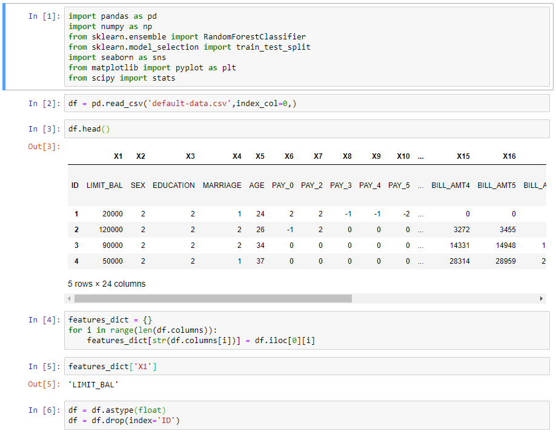
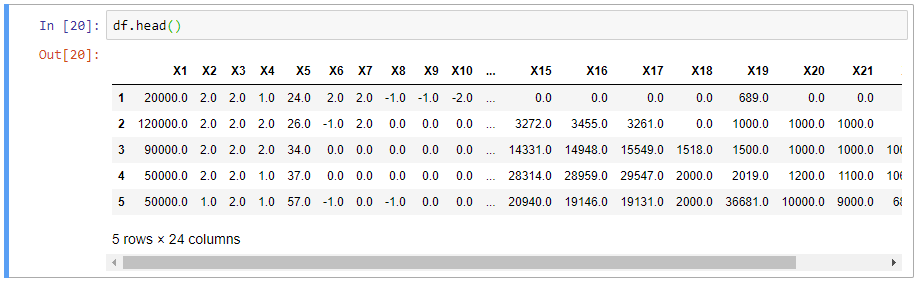
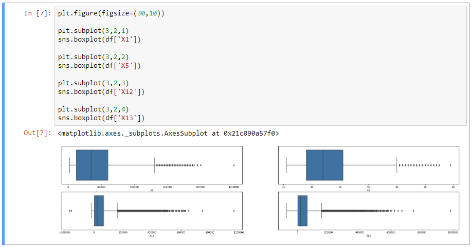
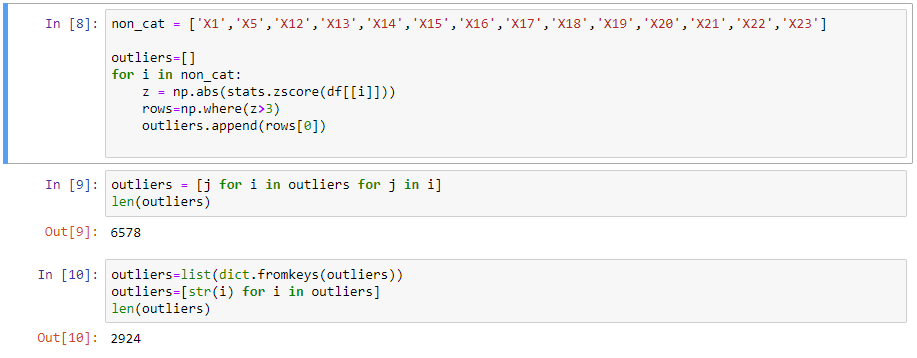
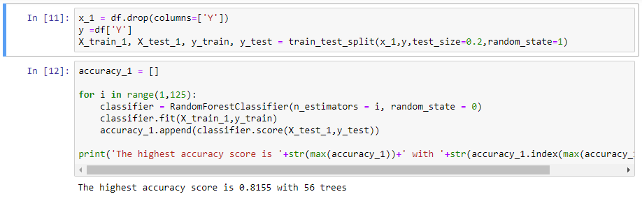
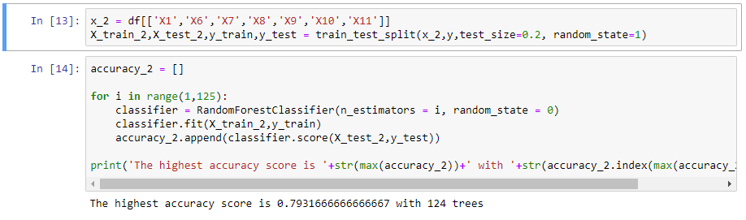
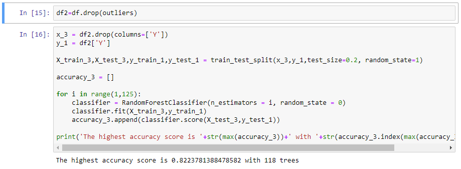
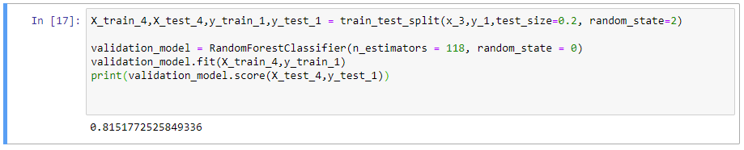

[Homepage](https://brandenmoo.github.io/)
# Predicting Whether Credit Card Clients Will Default
This project uses Random Forest Models to predict whether clients of a credit card company will default given some information about those clients.
The Random Forests in this project are made up of many decision trees, each with a subset of the overall data. 

### Project Details 
**Data Source Url:** http://archive.ics.uci.edu/ml/datasets/default+of+credit+card+clients 
**Model Type:** Random Forest  
**Source Code**: [GitHub File](https://github.com/brandenmoo/brandenmoo.github.io/blob/master/Source_Codes/RandomForestDefault.ipynb)

### Building The Model
While inspecting the data, I noticed the data structure isn’t correct, this would inter with building a model. 
To fix the issue, I stored the feature information in a dictionary and removed the row from the DataFrame. I used a 
dictionary so that I can easily access the feature description if needed. I also converted the entries in the DataFrame to a 
float type for easier manipulation:

So now, the new DataFrame looks like this: 

Next, I decided to create boxplots for some of the features just to get a summary of the data:

Since there the boxplots showed a lot of outliers, I created a for loop to iterate through all non categorical features to identify the rows that contained outliers. In this case, I classified outliers as data points 3 standard deviations from the mean: 

After removing duplicates, there’s 2924 rows that contain outliers. For now, I’ve stored it in a list called ‘outliers’. 

For the first random forest model, I decided to include all the features for the training data. Using a similar method found in k-nearest neighbour models, I used a for loop to build a model with varying numbers of trees to achieve highest accuracy:   

Now that I have a baseline model, I created a second model containing only a couple features that I thought had a high correlation with the output for comparison. Unsurprisingly, this model did not perform as well as the first model. Due to the composition of random forest models, it benefits from more data rather than less:

Since removing features didn’t improve the performance of the model, I wanted to create a model trained by data without the initial outliers. To do so, I created a second DataFrame and dropped the rows in ‘outliers’:  

 The accuracy score improved. I wanted to use this information to build another model to see if the score could be replicated. To do so, I’m going to use train_test_split with a random_state of 1, this will provide me with a ‘new’ set of data. For this validation model, I’m using 118 trees because that yielded the best accuracy score: 

Testing the model on a ‘new’ set of data yielded a fairly similar performance, so I’m confident that utilizing all features to build the random forest with 118 trees are the best combinations. 
